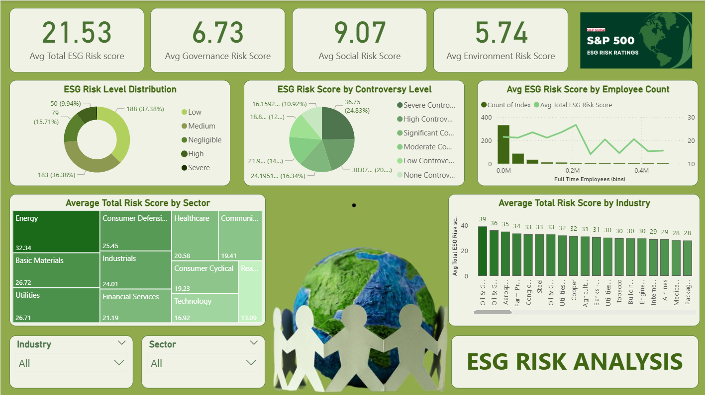
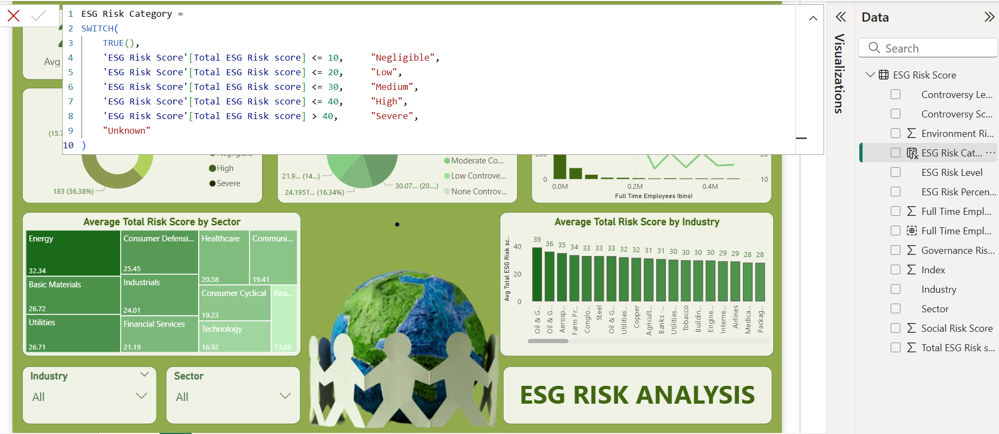

# S&P-500-ESG-Risk-Analysis-PowerBi

Comprehensive Power BI project analyzing ESG data of S&P 500 companies. It provides insights into Environmental, Social, and Governance (ESG) performance and risk profiles, helping researchers, investors, and analysts assess sustainability practices, ESG risks, and make informed investment decisions.

---

## 📊 Data

The project includes the ESG dataset used for analysis.

- `S&P 500 ESG Risk Ratings.csv`: Raw dataset of S&P 500 companies with ESG risk ratings.  
- `PowerBI_Files/ESG Risk Analysis.pbix`: Power BI file containing the connected, cleaned, and transformed dataset along with calculated DAX measures and visuals.

---

## 🔄 Latest Update

- Cleaned and transformed data in **Power Query** (added new column for ESG insights).  
- Created additional **DAX measures** for ESG performance metrics.  
- Designed and finalized dashboard visuals for ESG risk overview, sectoral analysis, and controversy insights.

---

## 📈 Dashboards Overview

### 1️⃣ ESG Risk Overview Dashboard
**KPI Cards:**
- Average ESG Risk Score  
- Average Environment, Governance, and Social Risk Scores  
- Average Controversy Score  
- ESG Risk Level Distribution  

**Charts:**
- Treemap: Sector-wise average ESG risk  
- Bar Chart: Industry-wise ESG risk comparison  
- Heatmap: ESG Risk Percentile vs. Controversy Level  
- Scatter Plot: ESG Risk Score vs. Full-Time Employees  

---

### 2️⃣ Sector & Industry Analysis Dashboard
**Filters:** Sector, Industry  

**Visuals:**
- Bar Chart: Top 10 industries with the highest ESG risk  
- Box Plot: ESG Risk Score distribution by sector  
- Stacked Column Chart: Contribution of Environmental, Governance, and Social Risks  

---

### 3️⃣ Controversy & ESG Risk Dashboard
**Key Insights:**
- Highlights companies with the highest Controversy Scores  

---

## 🧮 ESG Risk Score Categories

| ESG Risk Score | Risk Level   | Description |
|-----------------|--------------|--------------|
| 0 – 10          | Negligible   | Minimal ESG risks, strong sustainability practices. |
| 10 – 20         | Low          | Well-managed ESG risks with limited exposure. |
| 20 – 30         | Medium       | Moderate ESG risks that may require attention. |
| 30 – 40         | High         | Significant ESG risks with potential financial impact. |
| 40+             | Severe       | Major ESG risks that could affect business operations and reputation. |

---

## 🖼 Dashboard Preview

### Final Power BI Dashboard

### DAX Measure Screenshot

---

## 📚 Source

- **Dataset:** [Kaggle – S&P 500 ESG Risk Ratings] (https://www.kaggle.com/datasets/pritish509/s-and-p-500-esg-risk-ratings)
- **Tools Used:** Power BI, Power Query, DAX
  
## 📝 Author  
**Shuchita Jaiswal**  
📧 shuchita0201@gmail.com  
🔗 https://www.linkedin.com/in/shuchitajaiswal/ 
